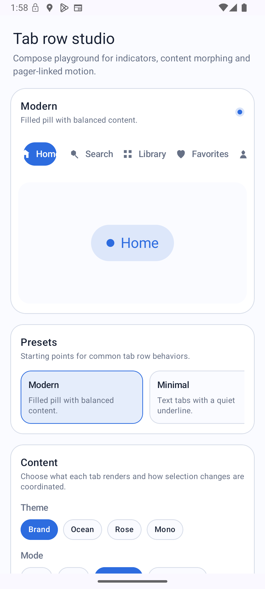

# TabRow

A fully customisable scrollable tab row for Jetpack Compose, driven by a `PagerState`.



---

## Table of contents

1. [Quick start](#quick-start)
2. [Installation](#installation)
3. [API overview](#api-overview)
4. [Configuration reference](#configuration-reference)
   - [TabItem — tab data](#tabitem--tab-data)
   - [TabColors — colors](#tabcolors--colors)
   - [TabStyle — shape & typography](#tabstyle--shape--typography)
   - [TabContentConfig — what each tab renders](#tabcontentconfig--what-each-tab-renders)
   - [TabContentOptions — transition & swap](#tabcontentoptions--transition--swap)
   - [TabIndicatorConfig — indicator style & motion](#tabindicatorconfig--indicator-style--motion)
   - [TabRowMotion — row-wide animation](#tabrowmotion--row-wide-animation)
5. [Usage examples](#usage-examples)
6. [Architecture](#architecture)
7. [Extending the library](#extending-the-library)
   - [Custom indicator style](#custom-indicator-style)
   - [Custom content transition](#custom-content-transition)
   - [Custom indicator motion](#custom-indicator-motion)
   - [Custom row motion](#custom-row-motion)
8. [Build & run](#build--run)

---

## Quick start

```kotlin
val tabs = listOf("Home", "Search", "Profile").toTabItems()
val pagerState = rememberPagerState(pageCount = { tabs.size })

CustomScrollableTabRow(tabs = tabs, pagerState = pagerState)

HorizontalPager(state = pagerState) { page -> /* page content */ }
```

That's the minimum. Every parameter has a sensible default.

---

## Installation

This is a single-module playground app. Copy the `tabrow` package into your project:

```
app/src/main/java/com/corneflex/tabrow/ui/components/tabrow/
```

The only external dependency is the standard Compose + Material 3 stack (already in any modern Compose project).

---

## API overview

The single public composable is `CustomScrollableTabRow`:

```kotlin
@Composable
fun CustomScrollableTabRow(
    tabs: List<TabItem>,              // tab data
    pagerState: PagerState,           // drives selection & indicator
    modifier: Modifier = Modifier,
    content: TabContentConfig = TabContentConfig.Text,
    contentOptions: TabContentOptions = TabContentOptions(),
    indicator: TabIndicatorConfig = TabIndicatorConfig(),
    motion: TabRowMotion = TabRowMotion.Smooth,
    colors: TabColors = TabDefaults.colors(),
    style: TabStyle = TabDefaults.style(),
    onTabClick: ((Int) -> Unit)? = null,  // override default pager scroll
)
```

All configuration lives in value objects built via `TabDefaults` or constructed directly.

---

## Configuration reference

### TabItem — tab data

```kotlin
data class TabItem(
    val text: String? = null,
    val icon: ImageVector? = null,
    val image: Painter? = null,
    val contentDescription: String? = text,
)
```

**Helper extensions** (from `TabRowExtensions`):

```kotlin
// Text-only tabs
val tabs = listOf("Home", "Search", "Profile").toTabItems()

// Icon + label tabs
val tabs = listOf(
    "Home" to Icons.Default.Home,
    "Search" to Icons.Default.Search,
).toIconTabItems()
```

---

### TabColors — colors

Controls content (text/icon tint) and container (background) colors for selected and unselected states.

```kotlin
// Material 3 theme colors (default)
colors = TabDefaults.colors()

// Custom tint
colors = TabDefaults.colors(
    selectedContentColor = Color.White,
    unselectedContentColor = Color.White.copy(alpha = 0.6f),
)

// Filled container (e.g. white pill on dark row)
colors = TabDefaults.filledColors(
    selectedContentColor = Color.Black,
    unselectedContentColor = Color.Gray,
    selectedContainerColor = Color.White,
)
```

**Copy helpers:**

```kotlin
colors.selectedColor(Color.Blue)
colors.unselectedColor(Color.Gray)
colors.containerColors(selected = Color.White)
```

---

### TabStyle — shape & typography

Controls the shape of each tab, text styles, borders, minimum height, and padding.

```kotlin
style = TabDefaults.style(
    shape = RoundedCornerShape(8.dp),
    selectedTextStyle = MaterialTheme.typography.labelLarge,
    unselectedTextStyle = MaterialTheme.typography.labelMedium,
    minHeight = 40.dp,
    horizontalPadding = 16.dp,   // inner padding, left/right of content
    verticalPadding = 10.dp,     // inner padding, above/below content
    itemSpacing = 4.dp,          // gap between adjacent tabs
    edgePadding = 8.dp,          // leading/trailing inset of the whole row
)

// Outlined tabs (border around each item)
style = TabDefaults.outlinedStyle(
    selectedBorderColor = Color.Black,
    unselectedBorderColor = Color.LightGray,
)
```

**Copy helpers:**

```kotlin
style.withShape(RoundedCornerShape(4.dp))
style.withTextStyles(selected = bold, unselected = normal)
style.withBorders(selected = BorderStroke(1.dp, Color.Black))
style.withSpacing(itemSpacing = 4.dp, horizontalPadding = 12.dp)
```

---

### TabContentConfig — what each tab renders

Defines what is drawn inside each tab.

| Value | Renders |
|---|---|
| `TabContentConfig.Text` | label text |
| `TabContentConfig.Icon` | icon only |
| `TabContentConfig.Image` | painter image |
| `TabContentConfig.IconText` | icon + label side by side |
| `TabContentConfig.ImageText` | image + label side by side |
| `TabContentConfig.Adaptive(unselected, selected)` | morphs between two styles as the pager scrolls |

```kotlin
// Icon when selected, text when unselected — morphs smoothly with pager
content = TabContentConfig.Adaptive(
    unselected = TabContentStyle.Text,
    selected = TabContentStyle.Icon,
)
```

---

### TabContentOptions — transition & swap

Groups content animation settings.

```kotlin
contentOptions = TabContentOptions(
    transition = TabContentTransition.FadeScale,   // AnimatedContent transition
    swapPolicy = TabContentSwapPolicy.Coordinated, // when content swaps
    iconOnlyHorizontalPadding = 8.dp,              // extra padding around icon-only tabs
    iconSize = 20.dp,                              // icon size (icon-only & icon + text)
    imageSize = 24.dp,                             // image size (image-only & image + text)
    contentSpacing = 8.dp,                         // gap between icon/image and text
)
```

#### TabContentTransition presets

| Preset | Effect |
|---|---|
| `None` | instant swap |
| `Fade` | cross-fade |
| `FadeScale` | cross-fade + slight scale (default) |
| `Scale` | scale in/out only |
| `Slide` / `SlideLeft` | slide from right |
| `SlideRight` | slide from left |
| `SlideUp` | slide from bottom |
| `SlideDown` | slide from top |
| `FadeThrough` | fade out then fade in (Material motion) |
| `Expand` / `ExpandFade` | horizontal expand/shrink |

#### TabContentSwapPolicy

| Value | Behaviour |
|---|---|
| `Coordinated` | content morphs continuously with pager scroll (default) |
| `Together` | both tabs swap when page settles |
| `DeselectThenSelect(delayMillis)` | deselect first, then select after a delay |

---

### TabIndicatorConfig — indicator style & motion

```kotlin
indicator = TabIndicatorConfig(
    style = TabIndicatorStyle.Pill(),
    motion = IndicatorMotion.Slide,   // null = inherit from TabRowMotion
    motionSpec = IndicatorMotionSpec(
        bounceScale = 1.08f,    // used by IndicatorMotion.Bounce
        fadeMinAlpha = 0.55f,   // used by IndicatorMotion.Fade
    ),
)
```

**Factory shortcuts:**

```kotlin
TabDefaults.indicator(style = TabIndicatorStyle.Underline())
TabDefaults.pillIndicator(color = Color.Black)
TabDefaults.underlineIndicator(color = Color.Blue, motion = IndicatorMotion.Snake)
TabDefaults.dotIndicator(color = Color.Red)
```

#### Built-in TabIndicatorStyle variants

All variants are `data class`es with `.copy()` support.

| Style | Shape | Default placement |
|---|---|---|
| `Pill` | full-radius rounded rect | BehindContent |
| `Rectangle` | slightly rounded rect | BehindContent |
| `Underline` | thin rounded line | Bottom |
| `Dash` | short rounded bar | Bottom |
| `Dot` | circle | Bottom |
| `Border` | transparent fill + border | BehindContent |
| `SideRoundedBorder` | flat top/bottom, rounded sides | BehindContent |
| `TopBottomBorder` | top & bottom lines only | BehindContent |

**Common parameters** (all styles):

```kotlin
TabIndicatorStyle.Pill(
    color = Color.Black,             // fill color
    border = BorderStroke(...),      // optional stroke
    placement = IndicatorPlacement.BehindContent, // Bottom / Top / BehindContent
    horizontalPadding = 12.dp,       // inset from tab edges
    height = 36.dp,
)
```

#### IndicatorMotion presets

| Value | Effect |
|---|---|
| `Slide` | linear interpolation (default) |
| `Snake` | leading edge leads, trailing edge follows |
| `Bounce` | scale pulse at mid-transition |
| `Fade` | alpha dip at mid-transition |
| `None` | instant jump |
| `Custom { … }` | compute the indicator geometry yourself — see [Custom indicator motion](#custom-indicator-motion) |

**Copy helpers:**

```kotlin
indicator.withMotion(IndicatorMotion.Snake)
indicator.withStyle(TabIndicatorStyle.Underline())
indicator.atBottom()        // move placement to Bottom
indicator.behindContent()   // move placement to BehindContent
```

---

### TabRowMotion — row-wide animation

Controls scroll animation, color/size transitions, and the fallback indicator motion.

| Preset | Feel |
|---|---|
| `TabRowMotion.Smooth` | tween, default |
| `TabRowMotion.Snappy` | fast spring |
| `TabRowMotion.Playful` | bouncy spring + Snake indicator |
| `TabRowMotion.None` | instant, no animation |

```kotlin
// Fully custom
motion = TabRowMotion.Custom(
    motion = IndicatorMotion.Snake,
    colorAnimationSpec = tween(200),
    sizeAnimationSpec = spring(stiffness = Spring.StiffnessMedium),
    scrollAnimationSpec = tween(300, easing = FastOutSlowInEasing),
)
```

---

## Usage examples

### Minimal — text tabs

```kotlin
CustomScrollableTabRow(tabs = tabs, pagerState = pagerState)
```

### Underline indicator

```kotlin
CustomScrollableTabRow(
    tabs = tabs,
    pagerState = pagerState,
    indicator = TabDefaults.underlineIndicator(color = MaterialTheme.colorScheme.primary),
)
```

### Filled pill with custom colors

```kotlin
CustomScrollableTabRow(
    tabs = tabs,
    pagerState = pagerState,
    colors = TabDefaults.filledColors(
        selectedContentColor = Color.White,
        unselectedContentColor = Color.Gray,
        selectedContainerColor = Color.Black,
    ),
    indicator = TabDefaults.pillIndicator(color = Color.Black),
)
```

### Adaptive icon ↔ text morphing

```kotlin
CustomScrollableTabRow(
    tabs = tabs,                          // TabItem with both text and icon
    pagerState = pagerState,
    content = TabContentConfig.Adaptive(
        unselected = TabContentStyle.Text,
        selected = TabContentStyle.IconText,
    ),
    contentOptions = TabContentOptions(
        transition = TabContentTransition.FadeScale,
        swapPolicy = TabContentSwapPolicy.Coordinated,
    ),
)
```

### Playful snake indicator

```kotlin
CustomScrollableTabRow(
    tabs = tabs,
    pagerState = pagerState,
    indicator = TabDefaults.underlineIndicator(motion = IndicatorMotion.Snake),
    motion = TabRowMotion.Playful,
)
```

### Outlined tabs (no indicator fill)

```kotlin
CustomScrollableTabRow(
    tabs = tabs,
    pagerState = pagerState,
    style = TabDefaults.outlinedStyle(
        selectedBorderColor = Color.Black,
        unselectedBorderColor = Color.LightGray,
    ),
    indicator = TabDefaults.indicator(
        style = TabIndicatorStyle.Border(
            border = BorderStroke(1.5.dp, Color.Black),
        ),
    ),
)
```

### Dot indicator with bounce

```kotlin
CustomScrollableTabRow(
    tabs = tabs,
    pagerState = pagerState,
    indicator = TabDefaults.dotIndicator(
        color = MaterialTheme.colorScheme.primary,
        motion = IndicatorMotion.Bounce,
    ),
)
```

---

## Architecture

```
tabrow/
├── CustomScrollableTabRow.kt      ← public API, thin orchestrator
│
├── model/                         ← pure data, no Compose dependencies
│   ├── TabItem.kt                 data model for one tab
│   ├── TabColors.kt               selected/unselected colors
│   └── TabStyle.kt                shape, typography, borders, sizing
│
├── config/                        ← behavior & animation configuration
│   ├── TabContentConfig.kt        content styles, swap policy, options
│   ├── TabContentTransition.kt    AnimatedContent transitions + layer visuals
│   ├── TabIndicatorConfig.kt      indicator style variants + placement
│   └── TabRowMotion.kt            row-wide animation presets
│
├── defaults/                      ← public factory & fluent API
│   ├── TabDefaults.kt             factory object (colors, style, indicator…)
│   └── TabRowExtensions.kt        copy-helper extensions on all config types
│
└── internal/                      ← implementation details (not public API)
    ├── TabRowLayout.kt            IndicatorLayer, CustomTab, CoordinatedTabContent
    ├── TabContentRenderer.kt      TabContent, IconTextContent, resolveContentStyle
    ├── TabIndicatorPositioner.kt  indicator position interpolation
    └── TabRowUtils.kt             lerp, lerpColor, Modifier helpers
```

### Data flow

```
PagerState.currentPage + currentPageOffsetFraction
        │
        └─► rememberPagerProgress ─┬─► IndicatorLayer (position interpolation)
                                   │
                                   └─► coordinatedFraction ─► CoordinatedTabContent
                                                               (alpha/scale/offset per layer)
```

Tab positions are tracked via `Modifier.onGloballyPositioned` into a `mutableStateMapOf<Int, TabMeasurement>`. The indicator positioner interpolates between neighbouring measurements based on the fractional pager progress.

---

## Extending the library

### Custom indicator style

Subclass `TabIndicatorStyle` and override `applyStyle` for any drawing logic:

```kotlin
class GradientPillIndicator(
    val startColor: Color,
    val endColor: Color,
) : TabIndicatorStyle() {
    override val color = Color.Transparent
    override val border: BorderStroke? = null
    override val placement = IndicatorPlacement.BehindContent
    override val horizontalPadding = 12.dp
    override val height = 36.dp
    override val shape: Shape = RoundedCornerShape(999.dp)

    override fun applyStyle(modifier: Modifier) = modifier.background(
        brush = Brush.horizontalGradient(listOf(startColor, endColor)),
        shape = shape,
    )
}

// Usage
indicator = TabIndicatorConfig(style = GradientPillIndicator(Color.Blue, Color.Purple))
```

You can also override `minimumUsefulWidth` (ensures the indicator never collapses below a useful size) and `effectiveHorizontalPadding` is computed automatically.

### Custom content transition

For full control over both `AnimatedContent` and the coordinated layer cross-fade, use `TabContentTransition.Custom` — or subclass it for a reusable named variant:

```kotlin
// Anonymous
val myTransition = TabContentTransition.Custom(
    enter = fadeIn(tween(200)) + slideInVertically { -it / 4 },
    exit  = fadeOut(tween(150)) + slideOutVertically { it / 4 },
    visual = { progress, entering ->
        ContentLayerVisual(
            alpha = progress,
            offsetYFactor = if (entering) (1f - progress) * 0.25f else -(1f - progress) * 0.25f,
        )
    },
)

// Reusable subclass
class SlideUpFadeTransition : TabContentTransition.Custom(
    enter = fadeIn(tween(200)) + slideInVertically { -it / 4 },
    exit  = fadeOut(tween(150)) + slideOutVertically { it / 4 },
    visual = { progress, entering ->
        ContentLayerVisual(
            alpha = progress,
            offsetYFactor = if (entering) (1f - progress) * 0.25f else -(1f - progress) * 0.25f,
        )
    },
)
```

`ContentLayerVisual` exposes four properties for the coordinated cross-fade layer:

| Property | Effect |
|---|---|
| `alpha` | opacity of the layer |
| `scale` | uniform scale (1f = no scale) |
| `offsetXFactor` | horizontal shift as a fraction of the tab width |
| `offsetYFactor` | vertical shift as a fraction of the tab height |

### Custom indicator motion

The four presets (`Slide`, `Snake`, `Bounce`, `Fade`) cover the common cases, but the way the indicator travels between tabs is fully open via `IndicatorMotion.Custom`. You receive the start/end geometry plus the `[0, 1]` transition fraction and return the interpolated geometry for the current frame:

```kotlin
indicator = TabDefaults.indicator(
    motion = IndicatorMotion.Custom { s ->
        // Ease-out cubic — the indicator leads, then settles
        val eased = 1f - (1f - s.fraction).pow(3)
        IndicatorTransform(
            left  = s.fromLeft  + (s.toLeft  - s.fromLeft)  * eased,
            right = s.fromRight + (s.toRight - s.fromRight) * eased,
        )
    },
)
```

`IndicatorMotionScope` (the receiver `s`) carries the pixel geometry of the transition:

| Property | Meaning |
|---|---|
| `fromLeft` / `fromRight` | indicator edges over the **departing** tab |
| `toLeft` / `toRight` | indicator edges over the **arriving** tab |
| `fraction` | `0f` at the start of the swipe, `1f` when settled |

`IndicatorTransform` is what you return for each frame:

| Property | Effect |
|---|---|
| `left` / `right` | indicator edges in pixels |
| `scale` | uniform scale (1f = none) — used by `Bounce` |
| `alpha` | opacity (1f = opaque) — used by `Fade` |

> For `Dot` indicators the width is fixed to the dot size and the position follows the tab centers, so `left`/`right` are ignored — `scale` and `alpha` still apply.

### Custom row motion

```kotlin
motion = TabRowMotion.Custom(
    motion = IndicatorMotion.Bounce,
    colorAnimationSpec = spring(dampingRatio = Spring.DampingRatioMediumBouncy),
    sizeAnimationSpec  = tween(180, easing = FastOutSlowInEasing),
    scrollAnimationSpec = tween(320, easing = FastOutSlowInEasing),
)
```

---

## Build & run

```bash
# Build debug APK
./gradlew assembleDebug

# Install on connected device / emulator
adb install -r app/build/outputs/apk/debug/app-debug.apk

# Run unit tests
./gradlew test
```
